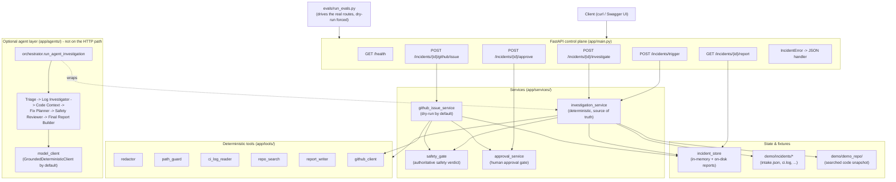
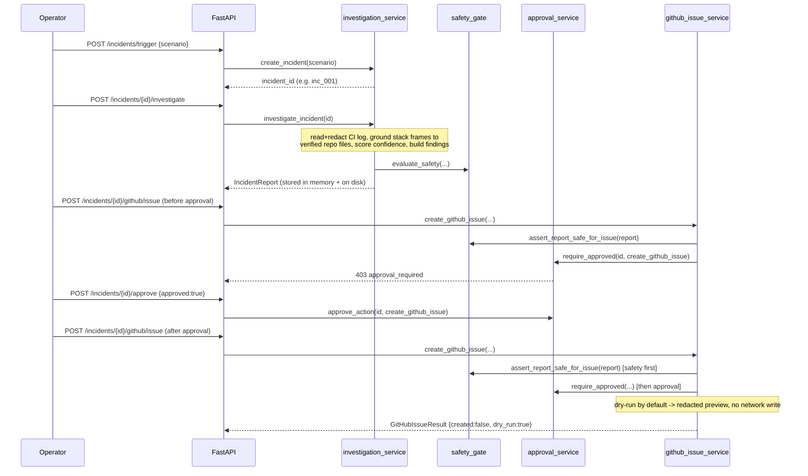

# IncidentPilot Architecture

IncidentPilot is an **approval-gated incident investigation assistant** for backend
failures. It ingests a simulated backend incident (CI logs, an optional API-error
fixture, a stack trace, and a local repo snapshot) and produces a single grounded,
human-reviewable `IncidentReport`. Every claim in that report is tied to evidence a
deterministic tool actually returned; nothing is invented. No external write (GitHub
issue) happens without a clean safety review **and** an explicit human approval, and
even then the default mode is dry-run.

This document explains how the pieces fit together. It describes the project as it is
actually implemented today; anything not yet wired up is called out explicitly under
[Honest scope notes](#honest-scope-notes).

## High-level component map



## FastAPI control plane

`app/main.py` creates the FastAPI app (`title="IncidentPilot"`, `version="0.1.0"`) and
registers four routers plus one exception handler:

- `app/api/routes_health.py` — liveness.
- `app/api/routes_incidents.py` — trigger, investigate, approve.
- `app/api/routes_reports.py` — report retrieval.
- `app/api/routes_github.py` — the gated GitHub-issue endpoint.

Route handlers are intentionally thin: each one translates HTTP to a single service
call and returns a Pydantic model. All workflow logic lives in the services. Domain
errors raised in the service layer (`app/services/errors.py`) subclass `IncidentError`,
which carries an HTTP `status_code` and an optional stable `reason` code
(`approval_required`, `safety_review_failed`, `approval_rejected`, `invalid_action`).
A single handler in `app/main.py` maps those to clean JSON, so a blocked response is
machine-readable without parsing prose and no handler builds error payloads by hand.

### Endpoints

| Method & path | Request body | Response model | Purpose |
| --- | --- | --- | --- |
| `GET /health` | — | `{status, service}` | Liveness check. |
| `POST /incidents/trigger` | `IncidentTriggerRequest{scenario}` | `IncidentTriggerResponse{incident_id, status, scenario}` | Load a demo scenario's `intake.json` and register the incident. |
| `POST /incidents/{id}/investigate` | — | `IncidentReport` | Run the deterministic investigation and return the grounded report. |
| `GET /incidents/{id}/report` | — | `IncidentReport` | Return the stored report (after investigate). |
| `POST /incidents/{id}/approve` | `ApprovalDecision{action, approved, approved_by, note}` (empty body = approve) | `ApprovalResponse` | Record an action-specific human approval/rejection. |
| `POST /incidents/{id}/github/issue` | `GitHubIssueOptions{dry_run, labels}` | `GitHubIssueResult` | Preview (default) or, only when fully unlocked, create the GitHub issue. |

## Incident lifecycle: trigger -> report -> approval -> GitHub issue

The end-to-end flow, and exactly where each gate sits:



The two gates are always evaluated in the same order, in the service layer (never in
the route, so they cannot be bypassed by calling a different endpoint): **safety first,
then approval.** A failed safety review or low confidence blocks issue creation
regardless of any approval on file, and an approval can never override an unsafe report.

## Deterministic investigation service

`app/services/investigation_service.py` is the source of truth and the only code path
the HTTP API uses to build a report. It has no LLM, no agents, no network, and no
database. Given a triggered incident id or a demo scenario name, it:

1. Reads and **redacts** the CI log via `ci_log_reader` (path-guarded load).
2. Parses plausible repository stack frames from the redacted log lines, filtering out
   third-party/tooling frames (`.venv`, `site-packages`, `node_modules`, ...).
3. **Grounds** each frame by re-resolving the file under the repo root with `path_guard`
   and re-reading the cited line with `repo_search.read_file_snippet`. A frame is cited
   only if its file exists and the line reads back non-empty — otherwise it is recorded
   as a *missing file*, never fabricated.
4. Scores `confidence` deterministically (error present +0.40, failing test +0.15,
   grounded code +0.35, capped at 0.95) and derives `severity`, `status`, and a
   root-cause `category` (`null_dereference`, `runtime_error`, `secret_exposure`,
   `undetermined`).
5. Assembles structured findings (log / code / root cause / fix plan) and a safety
   review, each carrying only grounded `EvidenceItem`s.
6. Persists a **redacted** `{incident_id}.json` and `{incident_id}.md` to the on-disk
   report store, then returns the `IncidentReport`.

A `CONFIDENCE_THRESHOLD` of 0.60 governs whether an automated diagnosis is treated as
trustworthy at the investigation level; the safety gate applies a stricter 0.75 bar
before a GitHub issue is even eligible.

## Schemas (Pydantic structured outputs)

All API contracts and the report shape live in `app/schemas/` and are strict Pydantic
models, so malformed data is rejected before it is stored or returned.

- `incident.py` — `IncidentIntake`, `IncidentTriggerRequest/Response`.
- `findings.py` — `EvidenceItem`, `LogFinding`, `CodeFinding`, `RootCauseHypothesis`,
  `FixPlan`, and the shared `ReviewedOutput` base (carries `confidence`,
  `needs_human_review`, `blocked_reasons`, `evidence`).
- `report.py` — `IncidentReport`: `incident_id`, `title`, `severity`
  (`SEV1|SEV2|SEV3|UNKNOWN`), `affected_service`, `status`, `primary_error`, the four
  findings, `safety_review`, and timestamps.
- `safety.py` — `SafetyReview` and `SafetyChecks` (the six structured safety invariants).
- `approval.py` — `ApprovalDecision/Response/Record`, the `ApprovalAction` literal, and
  `GitHubIssueOptions/Result`.

## Deterministic tools

Everything in `app/tools/` is pure and deterministic — the evidence layer the whole
system trusts.

- **`redactor.py`** — regex secret redaction. Typed, idempotent replacements
  (`[REDACTED_SECRET:type=...]`) for GitHub tokens, fine-grained PATs, OpenAI keys,
  bearer tokens, `DATABASE_URL`, connection strings, `api_key`, and `password`.
  Findings never carry more than a 4-character preview of a secret.
- **`path_guard.py`** — filesystem safety. Resolves paths (following symlinks) and
  rejects `..` traversal or anything that escapes the allowed root with `PathGuardError`.
- **`ci_log_reader.py`** — path-guarded CI-log load that redacts on read and extracts a
  primary error, a failing test, and a stack-trace span.
- **`repo_search.py`** — deterministic, path-guarded repo file read / snippet extraction
  used to verify cited code lines.
- **`report_writer.py`** — renders the redacted JSON and Markdown report and provides
  `ensure_report_safe` (a final redaction pass before any text leaves the system).
- **`github_client.py`** — the only module that can perform a real GitHub network write,
  and only when constructed in real mode by the GitHub issue service.

## Incident store

`app/storage/incident_store.py` is the single state holder. Its in-memory layer (a
module-global dict that resets on restart) tracks each incident's intake, latest report,
and approvals — the live source of truth during a request. Known demo scenarios get
stable ids (`broken_api_route -> inc_001`, `secret_in_logs -> inc_002`,
`ambiguous_error -> inc_003`).

A thin durable layer persists redacted reports to `app/storage/reports/` as
`{incident_id}.json` and `.md`. The store validates every report through the
`IncidentReport` schema and redacts every string before writing, and it treats
`incident_id` as untrusted (strict slug + `path_guard`) so a crafted id cannot escape
the reports directory. There is no database.

## Safety gate and approval gate

`app/services/safety_gate.py` is the authoritative, deterministic safety verdict. It
evaluates six invariants — secrets redacted, repo paths verified, confidence above the
0.75 issue threshold, no unverified file references, no direct production change, human
approval required — plus one hard extra rule: a report derived from a source that
contained secrets is never auto-eligible for an external write, even after redaction.
Each failing invariant maps to an exact, stable blocked-reason string. The gate
`assert_report_safe_for_issue` is called before any issue payload is built.

`app/services/approval_service.py` owns the human-in-the-loop gate. Approvals are
recorded per `(incident, action)` and default to `pending`, so an action stays blocked
until a human approves it. Rejection is sticky. Approving `create_github_issue` never
authorizes any other action. The gate requires an investigated incident, so an approval
can never be recorded for something that was never analyzed.

## GitHub issue flow (dry-run by default)

`app/services/github_issue_service.py` is the only path that may write an issue, and it
reuses (never reimplements) the safety and approval gates. It resolves to dry-run unless
**all** of the following hold: `GITHUB_DRY_RUN=false`, `GITHUB_TOKEN`/`GITHUB_OWNER`/
`GITHUB_REPO` are all present, the report passes safety, and a human approval is on file.
Any missing or invalid `GITHUB_DRY_RUN` value is treated as dry-run, so a
misconfiguration can never accidentally enable a live write. The issue title and body are
built only from the grounded, already-redacted report and are redacted once more before
they leave the module; the token never appears in any returned model or error message.

## Optional agent layer

`app/agents/` implements the required sequential multi-agent workflow as a thin
reasoning shell around the deterministic service. `orchestrator.run_agent_investigation`
computes the deterministic report first (the source of truth), then runs the agents in
fixed order — **Triage -> Log Investigator -> Code Context -> Fix Planner -> Safety
Reviewer -> Final Report Builder** — and applies a quality gate. Agents may only restate
the deterministic report's grounded findings: an `EvidenceIndex` rejects any evidence id
or file path the tools did not actually produce, so an agent cannot invent a path, line,
or root cause. A candidate report is used only if every agent step is valid and the
result is no weaker or less safe than deterministic (same severity, same grounded files,
same root-cause category, confidence not lower, human review not dropped, safety not
loosened); otherwise the deterministic report wins. No GitHub/PR/branch/commit write is
ever performed in this layer.

The model boundary (`app/agents/model_client.py`) defaults to
`GroundedDeterministicClient`, which performs no network call and no LLM inference — it
returns the agent's pre-grounded proposal as JSON. This makes agent mode reproducible and
offline by default while still exercising the orchestrator's validate/ground/fallback
machinery exactly as a real model would. A real model (e.g. a Gemini/ADK client) can be
dropped in by implementing `complete`; its output is still parsed, schema-validated, and
grounded, so at worst it triggers a deterministic fallback.

## Evaluation suite

`evals/run_evals.py` drives the **real** application flow (FastAPI routes + deterministic
services) for each case declared in `evals/evaluation_cases.yaml`:

```
trigger -> investigate -> github/issue (before approval) -> approve -> github/issue (after)
```

and computes six checks per case: `file_path_verified`, `line_evidence_present`,
`confidence_reasonable`, `no_secret_leak`, `safe_action_policy_passed`, and
`expected_blocking_behavior`. The runner is hermetic (reset store, throwaway temp reports
dir), fully offline (GitHub env scrubbed and dry-run forced, so no real issue can be
created), and verifies grounding independently — it re-resolves and re-reads every cited
repo path rather than trusting the report, and extracts secret literals straight from the
raw CI log to assert they never survive into a report or preview. It writes a Markdown
summary to `evals/results/evaluation_results.md` and exits non-zero only on an
*unexpected* failure; an "expected safe failure" (correctly refusing an un-groundable
incident) is counted separately.

## Honest scope notes

- **The served HTTP API path is purely deterministic.** Every endpoint calls
  `investigation_service` directly. The agent layer is fully implemented and unit-tested
  but is invoked only programmatically via `run_agent_investigation` (and by the test
  suite); it is **not** wired to a FastAPI route in this build.
- **No agent framework dependency is installed.** The sequential workflow is a custom
  orchestrator; `requirements.txt` contains no ADK/Gemini package. The default agent
  model client is offline and deterministic. `AGENT_MODE` and `GEMINI_API_KEY` exist as
  configuration placeholders but are not consumed on the request path — see
  [Future work](../README.md#future-work).
- **Live GitHub issue creation is not exercised by the demo.** The default and demo mode
  is dry-run; real creation requires deliberate configuration against a throwaway test
  repository.

See [security.md](security.md) for the threat model and safety guarantees, and
[demo_script.md](demo_script.md) for a runnable walkthrough.
